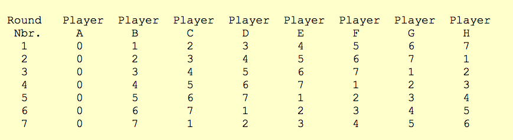
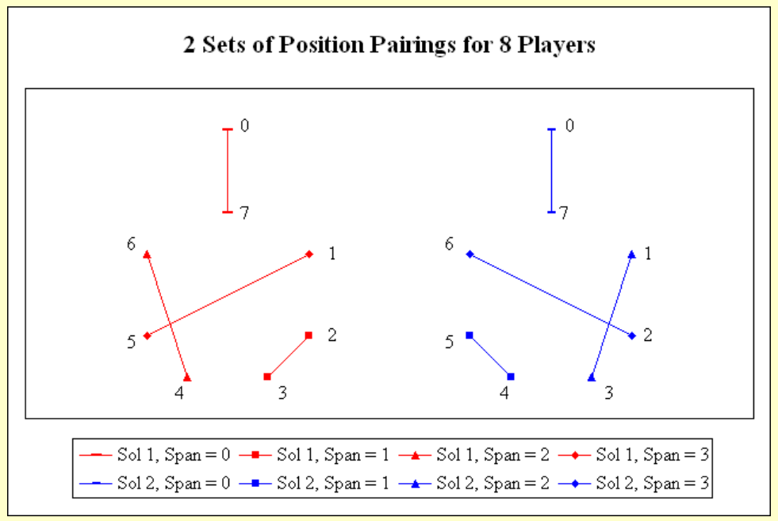

*Wikipedia: A* round-robin tournament *(or* all-play-all tournament*) is a [competition](https://en.wikipedia.org/wiki/Competition "Competition") in which each [contestant](https://en.wikipedia.org/wiki/Contestant "Contestant") meets all other contestants in turn.*

Hey there,

So you might think... how difficult could it be to code a round robin tournament generator? And I agree, for a simple case of N teams in which you want them to play once against each other... it really is not that hard. You can easily pick up this [wikipedia article](https://en.wikipedia.org/wiki/Round-robin_tournament) and I am sure you'll solve it in no time!

## NONETHELESS

There is a little *but* in this exercise.

This exercise was initially oriented towards a padel tennis doubles tournament. There would be two modes:

* Switch Round Robin Tournament - each player is paired up with each other player *once* and in extension plays *twice* against each player. The complexity arises when trying to find a solution that fulfils *both* conditions.
* Teams Round Robin Tournament - this would be the classic Round Robin Tournament, each team plays against each team once. It is pretty straightforward.

Let's focus in the first mode then!

## Switch Round Robin Tournament

After banging my head too many times trying to solve this exercise, I came across this [awesome blog](http://www.durangobill.com/BridgeCyclicSolutions.html) explaining how the cyclic solutions work. In his blog he solves the problem for the [bridge card game](https://en.wikipedia.org/wiki/Contract_bridge). In today's blog we will focus in the case of 4N players. We will use as example an 8 player round robin.

`Reminder: each player is paired up once and plays twice against each other player`

1. The first step is the same as solving a traditional round robin tournament. We will use the circle method. One player, in this case Player A, will always stay in position 0, while the others rotate position. You can see in the image below how each player moves along to the next position each round. As there are 8 players, they will each play 7 matches. Therefore there are a total of 7 rounds and thus they advance 7 positions in total.

   
2. Ok, they have advanced one position per round. The question now is, how do we pair them up so that by the end of the 7 rounds, they all have played *once* with each other and *twice* against all?

   If you do it randomly you will indeed achieve to fulfil the first condition. But you will obtain weird results like, one player playing against other 2 players 4 times, and playing 0 times against others.

   The answer to the question is quite fascinating. Take a look at the image below.

   

   Let's look just at the red figure. In this example all number, except 0, are arranged in a circle. Forget 0 for the time being. The key is to interconnect the numbers in such way, that each connection has a different length/chord distance. The line connecting 2 and 3 has a length of 1. The line connecting 4 and 6 has a length of 2. The line connecting 1 and 5 has a length of 3. And 0 and 7 have a fixed defined length of 0. As you can see each pair has a completely different length.

   The blue figure provides a symmetrical solution. Both solutions are equally valid, and in fact, there is a third solution. As proposed in [durangobill's post](http://www.durangobill.com/BridgeCyclicSolutions.html), see if you can find it ;)
3. Now that we have the pairs, the last step would be to permute each of the obtained teams and see if each player will play together *once* and against *twice* each other player. Using the different permutations for the red figure we obtain that the 3 permutations work. To illustrate a valid solution you can check the picture below:[](../assets/screen-shot-2021-02-07-at-19.31.41.png "Tables for 8 players Round Robin")

## Wrap up

To solve the problem all you have to do is create the positions sequence created in the first step.

Then calculate the different pairing combinations calculated placing the numbers in a circle. Personally I'd suggest just using the ones calculated in [durangobill's post](http://www.durangobill.com/BridgeCyclicSolutions.html). But you could also calculate them. I actually haven't done this yet but will upload later on.

Then each round place each player in their corresponding spot at the table and you'll have your schedule!

## Code

If you want to have a look at how this could be implemented I this was my approach. First I created a class to calculate the positions sequences. Simply call *SequenceGenerator.calculate* and it will automatically apply the correct method (for the case of 4N players or other).

```
class SequenceGenerator {
  static calculate(players: Player[]): number[][] {
    if (players.length % 4 === 0) return this.players4N(players);

    return this.players4Nplus1(players);
  }

  static players4N(players: Player[]): number[][] {
    let matrix: number[][] = [];
    const numberOfPlayers = players.length;

    // There are numberOfPlayers - 1 number of rounds
    for (let i = 0; i < numberOfPlayers - 1; i++) {
      matrix.push([]);
      for (let j = 0; j < numberOfPlayers; j++) {
        // first row goes 0,1,2,3,4...
        // and first column is all 0's
        if (i === 0) {
          matrix[i][j] = j;
        } else if (j === 0) {
          matrix[i][j] = 0;
        } else {
          // Rest of rows are calculated based on prev row
          const currentSum = matrix[i - 1][j] + 1;
          matrix[i][j] = currentSum >= numberOfPlayers ? 1 : currentSum;
        }
      }
    }

    return matrix;
  }

  // Here I have to add particular cases for 5,9,13, etc players
  static players4Nplus1(players: Player[]): number[][] {
    return [];
  }
}
```

To calculate the schedule I used the predefined tables for 8 players shown in the last picture. I simply hard-coded them as below:

```
// will add cases for 4,12,16,20... players

const tables: Tables = {
  // this means tables for 8 players
  8: [
    // first table
    [
      { 2: null, 3: null },
      { 4: null, 6: null },
    ],
    // second table
    [
      { 5: null, 1: null },
      { 7: null, 0: null },
    ],
  ],
};
```

The code to create the schedule is a bit long, nonetheless the method you are interested in is *calculate.* I believe by itself it should be understandable, but you can check the entire code in case you don't understand any of the helper methods.

The object *rawSchedule* delivers an array of rounds, containing each round an array of teams. What I did was transform this into an array of rounds, containing an array of IDs. The IDs belong to each match. Then each match is stored in a map of matches. The reason being to be able to easily update each match. 

*\* I have created classes for Match, Team, Players. I believe they are self explanatory so I will not really add their definitions so it doesn't make it more confusing.* 

*\*\* Nonetheless it is important to explain the interface Players refers to a Map with key the name of the player and value is class Player*

```
class SwitchRoundRobin {
  static calculate(players: Players): ScheduleInfo {
    const listOfPlayers = this.calculateListOfPlayers(players);

    let rawSchedule: [string, string][][][] = [];
    let schedule: string[][] = []; // Rounds with ID's of the matches
    let matches: MatchesMap = {}; // Map of matches stored by ID
    const positionsMatrix: number[][] = SequenceGenerator.calculate(listOfPlayers);

    if (!TABLES[players.size]) throw new Error(`Tables for ${players.size} number of players not calculated`);
    const tables = [...TABLES[players.size]];

    // Each Round players are assigned to their respective table
    // When tables are calculated the round is pushed to schedule
    for (let i = 0; i < positionsMatrix.length; i++) {
      const roundSequence = positionsMatrix[i];

      for (let j = 0; j < listOfPlayers.length; j++) {
        const player = listOfPlayers[j];
        const playerPosition = roundSequence[j];
        this.updateTable(player, playerPosition, tables);
      }

      const round = this.translateTablesToMatches(tables);
      const roundOfIDs = this.createMatches(players, round, matches);
      schedule.push(roundOfIDs);
      rawSchedule.push(round);
    }

    return {
      rawSchedule,
      schedule,
      matches,
    };
  }

  private static calculateListOfPlayers(players: Players) {
    const listOfPlayers = [];

    for (let [_, player] of players) {
      listOfPlayers.push(player);
    }

    return listOfPlayers;
  }

  private static updateTable(player: Player, playerPosition: number, tables: Table[]): void {
    for (let table of tables) {
      for (let team of table) {
        if (team.hasOwnProperty(playerPosition)) {
          team[playerPosition] = player.name;
        }
      }
    }
  }

  private static translateTablesToMatches(tables: Table[]): [string, string][][] {
    return tables.map((match) => {
      return match.map((team) => {
        const keys = Object.keys(team);
        return [team[keys[0]]!, team[keys[1]]!];
      });
    });
  }

  // I am not proud of this part of the code
  private static createMatches(players: Players, round: [string, string][][], matchesMap: MatchesMap) {
    const roundOfIDs = [];

    for (let match of round) {
      const localsArr: [string, string] = match[0];
      const visitorsArr: [string, string] = match[1];

      const firstLocal: Player | undefined = players.get(localsArr[0]);
      const secondLocal: Player | undefined = players.get(localsArr[1]);
      const firstVisitor: Player | undefined = players.get(visitorsArr[0]);
      const secondVisitor: Player | undefined = players.get(visitorsArr[1]);

      if (!firstLocal || !secondLocal || !firstVisitor || !secondVisitor)
        throw new Error(`Something went wrong getting players while creating matches`);

      const locals = new Team(firstLocal, secondLocal);
      const visitors = new Team(firstVisitor, secondVisitor);

      // Create new match and assign to matchesMap and add to roundOfIDs
      const randomID = uuid();
      const newMatch = new Match(String(randomID), locals, visitors);

      matchesMap[randomID] = newMatch;
      roundOfIDs.push(String(randomID));
    }

    return roundOfIDs;
  }
}
```


There is definitely a better solution, nonetheless it works and it is easily extendable. I am working on a library to be able to handle double tournaments which will include also brackets tournaments. 

I hope you enjoyed the post and if you want to go into more detail I highly encourage you to visit durangobills website. His explanation is way more detailed. 

If you want to propose a better solution I'd be glad to hear you out!