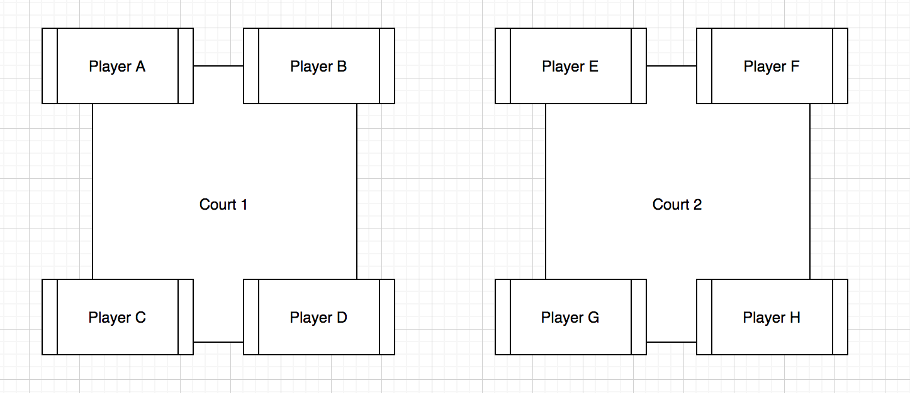
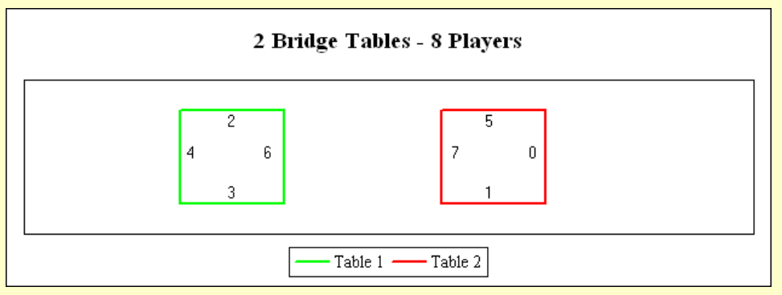

*\*\* Wikipedia: A* round-robin tournament *(or* all-play-all tournament*) is a [competition](https://en.wikipedia.org/wiki/Competition "Competition") in which each [contestant](https://en.wikipedia.org/wiki/Contestant "Contestant") meets all other contestants in turn.*

###### Hey there,

So you might think... how difficult could it be to code a round robin tournament generator? And I agree, for a simple case of N teams in which you want them to play once against each other, there are going to be N - 1 matches and... you get the drill, it really is not that hard. You can easily pick up this [wikipedia article](https://en.wikipedia.org/wiki/Round-robin_tournament) and I am sure you'll solve it in no time!

You'll soon see how this actually gets more complicated than anticipated.

This exercise was initially oriented towards a padel tennis doubles tournament. There are two modes:

* **Switch Round Robin Tournament** - each player is paired up with each other player *once* and in extension plays *twice* against each player. The complexity arises when trying to find a solution that fulfils *both* conditions.
* **Teams Round Robin Tournament** - this would be the classic Round Robin Tournament, each team plays against each team once. It is pretty straightforward and the case mentioned at the beginning. We'll skip this mode for today :)

The unexpected complexity came when trying to solve for Switch Round Robin Tournament. I thought I could apply the same methodology as in the Teams Round Robin Tournament but it does get way trickier than expected. The key to solve it is understanding how the combinatorics for each round work.

So without further ado, let's solve the freakin brain-teaser! 

## Switch Round Robin Tournament

After banging my head too many times against the wall trying to solve this exercise, I came across this [awesome blog](http://www.durangobill.com/BridgeCyclicSolutions.html) explaining how the cyclic solutions work. In the mentioned blog he solves the problem for the [bridge card game](https://en.wikipedia.org/wiki/Contract_bridge) which interestingly applies to our case! 

In today's blog we will focus in the case of 4N players. More concretely, we will use as example an 8 player Round Robin Tournament.

Reminder:

`First condition: each player is paired up once`

`Second condition (and by extension): each player plays twice against each other player`

How does this look like? Well something like this...

* Player “A” has had player “B” as a partner once and as an opponent twice.
* Player “A” has had player “C” as a partner once and as an opponent twice.
* Player “A” has had player “D” as a partner once and as an opponent twice.
* Player “A” has had player “E” as a partner once and as an opponent twice.
* Player “A” has had player “F” as a partner once and as an opponent twice.
* Player “A” has had player “G” as a partner once and as an opponent twice.
* Player “A” has had player “H” as a partner once and as an opponent twice.
* Player “B” has had player “A” as a partner once and as an opponent twice.
* Player “B” has had player “C” as a partner once and as an opponent twice.

and so on...

To achieve this, players must be partnered in a very specific way or else it won't just work. Let's start with the basic setup. 

* 8 players
* equals to 4 teams per round
* equals to 2 matches per round 

More visually:



The players in this picture were randomly placed. The key to solve the exercise, and personally what I found most complicated, is to learn how to pair up the teams so that both conditions fulfil. There are in total 8 different positions, and we have to learn in which position we have to place each player in each round. 

How do we do this?

Take a look at the picture below:


Let's look just at the red figure. In this example all numbers from 0 to 7 - that is for 8 positions - except 0, are arranged in a circle. Forget 0 and 7 for the time being. The key is to interconnect the numbers in such way, that each connection has a different length/chord distance. The line connecting 2 and 3 has a length of 1. The line connecting 4 and 6 has a length of 2. The line connecting 1 and 5 has a length of 3. And 0 and 7 have a fixed defined length of 0. As you can see, each pair has a unique length. So for example, we obtain the following as a possible solution: 

`2 and 3`**`vs `**

`5 and 1 ``vs `

Other permutations from grouping the red pairs into 2s are also valid.

The blue figure provides a symmetrical solution. Both solutions are equally valid, and in fact, there is a third solution. As proposed in [durangobill's post](http://www.durangobill.com/BridgeCyclicSolutions.html), see if you can find it ;)

In a more visual way, the courts then would look like this:



So if we had in a round:

* Player “A” in position 0
* Player “B” in position 1
* Player “C” in position 2
* Player “D” in position 3
* Player “E” in position 4
* Player “F” in position 5
* Player “G” in position 6
* Player “H” in position 7

The first round would have 2 matches (as mentioned before):

`2 and 3 ``vs `

`5 and 1 ``vs `

which translates to

`C and D ``vs `

`F and B ``vs `

Which results in our last step! How to calculate in what position each player has to play each round? And this is the easy part. If you checked out at the beginning the link for Round Robin Tournament, we will be using here the Circle's Method. 

* Player A is always going to play in position 0
* All other players are going to rotate, advancing one position per round - which means each player will play in a different position each round, excepts player A of course
* As there are 8 players the number of rotations is N - 1 thus 7

The resulting rotation can be seen in the following matrix:


The only thing left to do is place each player in their corresponding position in each round (as we did before) and we will have the schedule. Here is an example of how if would look like for the first 4 rounds:

**Round 1**

* 2 and 3 **vs** 4 and 6
* 5 and 1 **vs** 7 and 0

**Round 2**

* 2 and 3 **vs** 5 and 1
* 4 and 6 **vs** 7 and 0

**Round 3**

* 2 and 3 **vs** 7 and 0 
* 4 and 6 **vs** 5 and 1

**Round 4**

* 4 and 5 **vs** 1 and 3 
* 6 and 2 **vs** 7 and 0

and so on...

And you're done!

## Wrap up

1. Calculate the different pairing combinations by placing the numbers in a circle. Personally I'd suggest just using the ones calculated in [durangobill's post](http://www.durangobill.com/BridgeCyclicSolutions.html) as the different possible combinations can immensely increase as you increase the number of participants. *I haven't coded this part yet but is in my to-do list.*
2. *C*reate the positions sequence by place a player in position 0 at all times and having the others rotate position.
3. Then for each round place each player in their corresponding spot at the table and you'll have your schedule!

## Code

*\*\* doubles-tournament library coming soon to npm where you will be able to see the entire code, I know at the minute the code below looks quite confusing. I apologise for that. Instead of deleting this section I'll leave in case you want to use it but the important part of the post if the explanation of how Switch Partners Round Robin works.*

This was my code solution to the previous steps. First I created a class to calculate the positions sequences. Simply call *SequenceGenerator.calculate* and it will automatically apply the correct method (for the case of 4N players or other).

```
class SequenceGenerator {
  static calculate(players: Player[]): number[][] {
    if (players.length % 4 === 0) return this.players4N(players);

    return this.players4Nplus1(players);
  }

  static players4N(players: Player[]): number[][] {
    let matrix: number[][] = [];
    const numberOfPlayers = players.length;

    // There are numberOfPlayers - 1 number of rounds
    for (let i = 0; i < numberOfPlayers - 1; i++) {
      matrix.push([]);
      for (let j = 0; j < numberOfPlayers; j++) {
        // first row goes 0,1,2,3,4...
        // and first column is all 0's
        if (i === 0) {
          matrix[i][j] = j;
        } else if (j === 0) {
          matrix[i][j] = 0;
        } else {
          // Rest of rows are calculated based on prev row
          const currentSum = matrix[i - 1][j] + 1;
          matrix[i][j] = currentSum >= numberOfPlayers ? 1 : currentSum;
        }
      }
    }

    return matrix;
  }

  // Here I have to add particular cases for 5,9,13, etc players
  static players4Nplus1(players: Player[]): number[][] {
    return [];
  }
}
```

To calculate the schedule we need the "tables", the  I used the predefined tables for 8 players shown in the last picture. I simply hard-coded them as below:

```
// will add cases for 4,12,16,20... players

const tables: Tables = {
  // this means tables for 8 players
  8: [
    // first table
    [
      { 2: null, 3: null },
      { 4: null, 6: null },
    ],
    // second table
    [
      { 5: null, 1: null },
      { 7: null, 0: null },
    ],
  ],
};
```

The code to create the schedule is a bit long, nonetheless the method you are interested in is *calculate.* I believe by itself it should be understandable, but you can check the entire code in case you don't understand any of the helper methods.

The object *rawSchedule* delivers an array of rounds, containing each round an array of teams. What I did was transform this into an array of rounds, containing an array of IDs. The IDs belong to each match. Then each match is stored in a map of matches. The reason being to be able to easily update each match. 

*\* I have created classes for Match, Team, Players. I believe they are self explanatory so I will not really add their definitions so it doesn't make it more confusing.* 

*\*\* Nonetheless it is important to explain the interface Players refers to a Map with key the name of the player and value is class Player*

```
class SwitchRoundRobin {
  static calculate(players: Players): ScheduleInfo {
    const listOfPlayers = this.calculateListOfPlayers(players);

    let rawSchedule: [string, string][][][] = [];
    let schedule: string[][] = []; // Rounds with ID's of the matches
    let matches: MatchesMap = {}; // Map of matches stored by ID
    const positionsMatrix: number[][] = SequenceGenerator.calculate(listOfPlayers);

    if (!TABLES[players.size]) throw new Error(`Tables for ${players.size} number of players not calculated`);
    const tables = [...TABLES[players.size]];

    // Each Round players are assigned to their respective table
    // When tables are calculated the round is pushed to schedule
    for (let i = 0; i < positionsMatrix.length; i++) {
      const roundSequence = positionsMatrix[i];

      for (let j = 0; j < listOfPlayers.length; j++) {
        const player = listOfPlayers[j];
        const playerPosition = roundSequence[j];
        this.updateTable(player, playerPosition, tables);
      }

      const round = this.translateTablesToMatches(tables);
      const roundOfIDs = this.createMatches(players, round, matches);
      schedule.push(roundOfIDs);
      rawSchedule.push(round);
    }

    return {
      rawSchedule,
      schedule,
      matches,
    };
  }

  private static calculateListOfPlayers(players: Players) {
    const listOfPlayers = [];

    for (let [_, player] of players) {
      listOfPlayers.push(player);
    }

    return listOfPlayers;
  }

  private static updateTable(player: Player, playerPosition: number, tables: Table[]): void {
    for (let table of tables) {
      for (let team of table) {
        if (team.hasOwnProperty(playerPosition)) {
          team[playerPosition] = player.name;
        }
      }
    }
  }

  private static translateTablesToMatches(tables: Table[]): [string, string][][] {
    return tables.map((match) => {
      return match.map((team) => {
        const keys = Object.keys(team);
        return [team[keys[0]]!, team[keys[1]]!];
      });
    });
  }

  // I am not proud of this part of the code
  private static createMatches(players: Players, round: [string, string][][], matchesMap: MatchesMap) {
    const roundOfIDs = [];

    for (let match of round) {
      const localsArr: [string, string] = match[0];
      const visitorsArr: [string, string] = match[1];

      const firstLocal: Player | undefined = players.get(localsArr[0]);
      const secondLocal: Player | undefined = players.get(localsArr[1]);
      const firstVisitor: Player | undefined = players.get(visitorsArr[0]);
      const secondVisitor: Player | undefined = players.get(visitorsArr[1]);

      if (!firstLocal || !secondLocal || !firstVisitor || !secondVisitor)
        throw new Error(`Something went wrong getting players while creating matches`);

      const locals = new Team(firstLocal, secondLocal);
      const visitors = new Team(firstVisitor, secondVisitor);

      // Create new match and assign to matchesMap and add to roundOfIDs
      const randomID = uuid();
      const newMatch = new Match(String(randomID), locals, visitors);

      matchesMap[randomID] = newMatch;
      roundOfIDs.push(String(randomID));
    }

    return roundOfIDs;
  }
}
```

There is definitely a better solution, nonetheless it works and it is open for extension. If you want to propose a better solution I'd be glad to hear you out!

I hope you enjoyed the post and if you want to go into more detail I highly encourage you to visit [durangobills](http://www.durangobill.com/BridgeCyclicSolutions.html) website. His explanation is way more detailed.

I am currently working on a library to be able to handle double tournaments which will include both round robin modes plus brackets single and double elimination soy stay tuned!