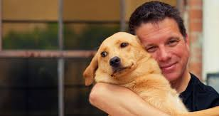

Two months ago, my girlfriend and I adopted a cute little dog. She is lovely and super smart dog. I soon understood what dog love is all about, and why people lose their minds for their best friend.

Unfortunately, today I learnt a harsh dog fact.

`- Viewer discretion advised -`

#### Dogs don't like hugs.

Of course there are some dogs that do like hugging, nonetheless, it is apparently something common in many dogs. In case you don't believe me, I was told today a good exercise you can do yourself to prove it. If you search in google images something like *'hugging dog'*, you will find an incredible amount of pictures of people hugging a dog with.... *sad drum roll... uncomfortable* eye rolling. 

Check out the dog's eyes, please, they are clearly not enjoying or seem confused/forced whilst being hugged, specially when the *supposedly* owner is picking the dog up.

I seems it is something we will have to live with. Hopefully your dog will grow a hugger.

I wish you and your dog the best!