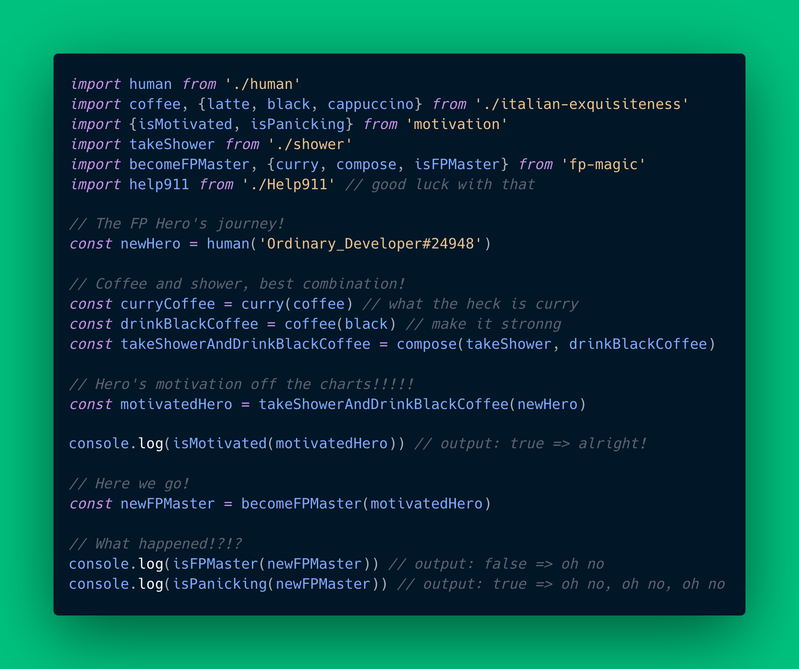

> Divide each difficulty into as many parts as feasible and necessary to resolve it. 
>
> René Descartes
 
Right before summer I started a series of sessions on functional programming (FP) with my work colleagues, during which we saw the motivation and basics for functional programming. I am by no means an expert on the topic, nevertheless some time ago I started getting on the subject and its potential waxed an interest in me. There were two concepts in particular that had my curiosity, but it wasn't until I got to study them more in depth that I grasped their potential: currying and closures. 

As I had been warned when I started my journey in FP, these techniques (currying, closures and others that I will mention below) are of the kind you might feel skeptical at first, and once you start using them you just can't stop using them. The only inconvenient I've encountered so far is, some techniques in FP, such as the two mentioned, may not be so intuitive at first, and that could cause some problems when working with other developers not familiarised with these techniques. After all, your code is meant to be understood by people, and executed by machines.

The most fascinating aspect of FP for me was nonetheless, a very simple and universal principal in programming: split every single function into one small unique task. It may be as simple as add two numbers; it may be to add an exclamation mark at the end of a string or even just to check if an input is a string. It doesn't matter how stupidly small and redundant the function may seem, just keep it simple. It is fascinating for me because many people will associate this (split everything into small discrete functions) paradigm to FP, whereas it is plainly just good old clean code. So many advantages will derive from this, you'll quickly realise how easy is to debug for any errors or how convenient is to adapt an old function to new requirements. For the previous reasons I decided to host these sessions on FP. It doesn't matter whether you start coding purely with FP, the tenets in which FP is based are applicable to any kind of programming paradigm, hence making you a better coder.

Below are the topics covered during the sessions. As you might have guessed it already, if you are familiarised with FP, Session 1 was all about pure and impure functions, the basis of FP (and clean code). This blog is meant to be just an introductory guide, I will give a brief explanation for each of the key concepts, hopefully enough for you to continue the journey on your own:

* What is functional programming
* Pure/Impure functions
* Higher Order Functions
* Closures
* Currying
* Functions Composition

Don't let the fancy names scare you, let the code scare you! 😝 Let's start!



# What is functional programming

> Functional programming (often abbreviated FP) is the process of building software by composing pure functions, avoiding shared state, mutable data, and side-effects. Functional programming is declarative rather than imperative, and application state flows through pure functions. Contrast with object oriented programming, where application state is usually shared and colocated with methods in objects.

*So... what the heck is functional programming?* We will see what composing pure functions is all about, for the time being we will focus on the statements *shared state*, *mutable data*, *side-effects* and *declarative rather than imperative*. We will explain what these means as we get along with the content, for the time being I'll give a brief explanation on what it means.

In FP there is no shared state, there are no classes holding any kind of private data or variables which can be modified by different methods. These also alludes to avoiding mutable data, by all means we don't want to rely on that that might have been modified and can cause unexpected behaviors, we can predict what the output is going to be. And finally, the code will declare the actions verbosely instead of spitting a series of operations which can take some time to read and learn what it actually does. You can see the result in the example above describing the *Hero's journey to learn Functional Programming*. 

Our new hero will be a human who went to sleep fully motivated and ready to learn this puzzling paradigm. First things first, our hero will prepare a black coffee and take a shower. These two actions are actually combined in the *compose* function. Finally our dear motivated hero will become a FP master but unfortunately he ends up *not* becoming a FP master and is actually panicking. It is not mandatory to understand exactly what each function does, the purpose of the snippet is to prove how without having a clue how each function is implemented you are able to understand exactly what is happening to our hero. 

Let's get started with the basics.

# Pure/Impure functions

> Pure functions are functions that for a series of arguments will always return the same output. Pure functions perform **one** and one task only and their output is predictable. 

Let's see some simple examples:

```
// example 1
function add(a,b){
  return a + b;
}

const exampleAdd = add(3,5);

// example 2
function calculateFactorial(num){
  let result = num;
  for(let i = 1; i < num; i++){
    result = result * i;
  }
  return result
}

const exampleFactorial = calculateFactorial(5);
```

As you can see, in the given examples for the given arguments the output is always going to be the same; it becomes pivotal for testing and predictability.

An impure function is a function that mutates variables/state/data outside of it’s lexical scope, thus deeming it *impure* for this reason. Let's see some simple examples:

```
// example 1 
let author = 'John Doe';

function logAuthor(){
  console.log(author);
}

author = 'Mr. John Doe';
logAuthor();

// example 2
const numbers = [1, 2, 3, 4, 5];

numbers.splice(0,1);
```

In example 1 the function *logAuthor* relies on data outside its scope, therefore when logging the value of author, in this case, the value has been updated and thus it will not log the expected value *John Doe*. In the second example is not as clear but the function *splice* will modify the array *numbers*, therefore when re-using *numbers* as an input argument for another function its value will have been modified and thus creating what we want to avoid which is, unpredictable outputs.

Understanding these two concepts is key in FP and personally I believe it is also key as a developer. Being able to instantly differentiate when you are mutating data which you rely on will make your code more consistent. 

# High order functions

This one has definitely the most intimidating name but the concept is actually quite straightforward and you have actually been using these ALL the time. 

> Higher order functions are functions that operate on other functions, either by taking them as arguments or by returning them. In simple words, A Higher-Order function is a function that receives a function as an argument or returns the function as output. Enough with the confusing explanations, let's see the code:

```
// example array
const pets = [
  {name: 'fluffy', animal: 'dog'},
  {name: 'windows', animal: 'cat'},
  {name: 'sergel', animal: 'dragon'},
  {name: 'functionalprogrammingYay', animal: 'dog'}
]

// We want to filter the items with animal === dog
// Two methods:

// BAD way - although being totally honest it is actually
// a bit faster in computational terms
let dogs = [];
for(let i =0; i < pets.length; i++){
  if(pets[i].animal === 'dog'){
    dogs.push(pets[i])
  }
}


// GOOD way! 
dogs = pets.filter( pet => pet.animal === 'dog')

// To make it even better we can extract the filtering logic
const DOG = 'dog'
const isDog = (animal) => animal === DOG;

// simplified solution!
dogs = pets.filter(isDog);
```

The more intuitive manner of filtering the dogs from the *pets* array would be by iterating them and creating a new array called *dogs*. As you can see in the example the function *filter* takes a function as an argument handling the logic to determine if the animal is indeed a dog or not. By applying this method the result is a more verbose solution which is simply to filter the pets and check if they are a dog. 

# Closures

> A closure is the combination of a function bundled together (enclosed) with references to its surrounding state (the lexical environment). In other words, a closure gives you access to an outer function’s scope from an inner function. In JavaScript, closures are created every time a function is created, at function creation time ([](https://developer.mozilla.org/en-US/docs/Web/JavaScript/Closures)[Mozilla Developer](https://developer.mozilla.org/en-US/docs/Web/JavaScript/Closures)). 

It is one of those concepts I personally must see in action to understand so let's do it:

```
// example 1 -> taken from above
let author = 'John Doe';

function logAuthor(){
  // references to author which is 
  // outside of the scope of the function.
  // Therefore it is a closure
  console.log(author); 
}

// example 2
let counter = function(n){
  let counter = n ? n : 0;

  return function(){
    // The inner function updates counter
    // which is in the outer scope
    counter++;
    return counter;
  }
}

// How to use? 
const passengersCounter = counter(100); // initiate counter at 100
console.log(passengersCounter()); // output: 101
console.log(passengersCounter()) // output: 102
```

Even though the first example is not desirable as we described earlier because it is not a pure function, is still a closure, as it is accessing a variable outside its functions scope. The second example provides a solid and simple use case of a closure; counter initiated with the value *n* if provided; when called in the second function it will not only increase the value of the counter but as the variable is enclosed in the upper level it guarantees the variable cannot be modified in any possible scenarios; it is a private variable. What this means is if in any part of the code you trying to modify the value of the counter the closure will prevent it, only the inner function is capable of doing so. 

I am a big fan of closures, having private variables *protected* from the outside and being able to create methods to play around with them is so much fun. Let's see another example a little bit more complex:

```
// example 3
const query = url => {
  // We will use this to cache requests
  // If /post/1 has already been retrieved, 
  // instead of making the API call again we
  // will just extract it from the cache
  let cache = {};


  return async function(path){
    // check for data in cache first
    if(cache[path]){
      console.log(path, 'found in cache')
      return cache[path]
    }
    
    // data not in cache then make API call
    const response = await axios.get(`${url}${path}`);
    const data = response.data;
    cache[path] = data;
    return data;
  }
}

// JSON Placeholder is an awesome tool to test API calls
const jsonPlaceholderDomain = 'https://jsonplaceholder.typicode.com'
const jpFetcher = query(jsonPlaceholderDomain);

jpFetcher('/posts/3').then(res => {
  // the second call is retrieved from
  // the cache instead of making the call
  jpFetcher('/posts/3')
 })
```

This is a very useful example, in case you are developing let's say a mobile app, you want to limit the number of API calls your app performs, if possible, to make it faster. Caching will help greatly. In the example a cache is initiated to store API calls in order to prevent making the same API call of the information is already available. As mentioned above, it is one of those techniques it may not seem so intuitive at first, but once you start using it you just can't stop. Speaking of which, same will occur with currying. 

# Currying

> Currying is a transformation of functions that translates a function from callable as f(a, b, c) into callable as f(a)(b)(c). 

This definition is just as easy as it gets. The benefit of currying is being able to assign a variable to a curried function. It can be shown in the following rudimentary implementation:

```
// example 1

const addOldWay = function(a,b){
  return a + b;
}

const addCurryWay = a => b => a + b;


const addTen = addCurryWay(10);
const addOneHundred = addCurryWay(100);

const currentNumberOfEmployees = 53;
// add the ten new hires to the hotel personnel
const hotelPersonnel = addTen(currentNumberOfEmployees); 

// Example 2 - this is a handy one!
// Creating your API endpoints clean and concisely 
const createUrl = base => endpoint => `${base}${endpoint}`;

// create base url for each 'destination'
const srvDestination = createUrl('http://backend-server');
const northwind = createUrl('https://northwind.com')

// create specific endpoints for each destination:

// Server Endpoints
const news = srvDestination('/news');
const profile = srvDestination('/profile');
const posts = srvDestination('/posts');
const user = user => srvDestination(`/Users/${user}`);
const createGroup = user => srvDestination(`/Groups/${user}`);

// Northwind Endpoints
const northwindV1 = northwind('/api/v1')
const northwindV2 = northwind('/api/v2')

// Output
console.log(news); // output: http://backend-server/news
console.log(profile); // output: http://backend-server/profile
console.log(posts); // output: http://backend-server/posts
console.log(user('fakeUser')); // output: http://backend-server/Users/fakeUser
console.log(createGroup('fakeUser')) // output: http://backend-server/Groups/fakeUser
console.log(northwindV1) // output: https://northwind.com/api/v1
console.log(northwindV2) // output: https://northwind.com/api/v2
```

The second example is particularly interesting as it provides the weary creation of API endpoints with a very organized and elegant structure. It really doesn't make that much sense to try to explain the code it is better just to re-read a couple of times. I know it is confusing at first, I've been there.

# Function composition

It has been a long way but you made it to the very end! Unfortunately this is not going any more easier than the previous topic. Let's have a look at the definition: 

> Function composition is the process of combining two or more functions to produce a new function, it is represented by f,g => f(g(x)).

```
const compose = (f,g) => x => f(g(x));

// example 1
const addOne = x => x +1;
const square = x => x * x;
const inchToCm = x => x * 2.54;

const addOneAndSquare = compose(square, addOne);
const calculateAreaInCms = compose(square, inchToCm); 

console.log(addOneAndSquare(3)); // output: 16
console.log(calculateAreaInCms(3)); // output: 58.0644
```

In the example code the first task is to define what are the functions, in their simplest form, we are going to require. The benefit of applying this approach is the function reusability and whenever a better implementation has to be applied it will automatically affect all the code base. 

Another benefit is the resulting code in a more verbose manner. Even if the functions *addOne*, *square* and *inchToCm* had been imported, therefore you wouldn't have their plain definition in front of you, if you see in the code *compose(square, addOne)* you can foresee the result. It comes intuitively the operations that are going to be performed over the input argument. 

This technique does take some time to acquire but the results are formidable. 

# Conclusion

These are the techniques we learned during the sessions but I didn't really deep dove into complex scenarios, as I wanted this to serve as a brief intro into the matter. The intention is to not overwhelm with cumbersome examples but to be able to understand the techniques and why they can substantially make your life easier. May it also serve you as a guideline if you want to keep exploring the subject.

Personally it has been a lot of fun, I didn't know hosting this workshop would actually drain so much energy from me leaving me completely worn out after each session. It takes some effort to develop a session with compelling storytelling in English (not my native language), but furthermore it is even harder to do so while coding. I could literally feel my entire brain working at 100% capacity; in no other situation had I had so many sections of my brain at full power. Do not take this as a complain, on the contrary, to me it was completely reinvigorating. It pushes you to the limit and improves so many competences such as live coding, storytelling, public speaking and technical preparation. 

My experience was so substantial I am working on encouraging my colleagues present their own topics, some of them have already done so and have had such a great time. 

Have you gone through a similar experience? I'd love to hear about it.