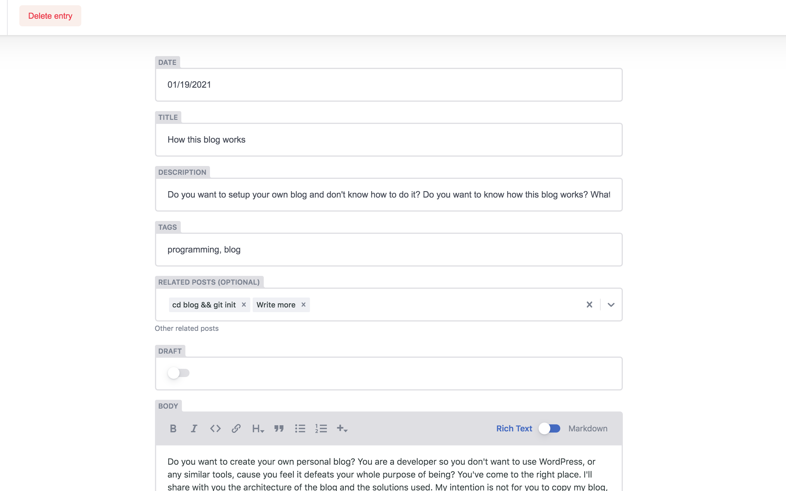

Do you want to create your own personal blog? You are a developer so you don't want to use WordPress, or any similar tools, cause you feel it defeats your whole purpose of being? You've come to the right place. I'll share with you the architecture of the blog and the solutions used. My intention is not for you to copy my blog,  but for you to have an overview of the things you may require if you want to build a similar one. 

Myself, like so many other people, I also wanted to have my own little space in the Internet, but it wasn't until a few months ago that I actually got into building it. I could write a very long post explaining how I built the entire thing and detailing every single part but it would be too lengthy. Instead, I decided to list the different features I want to have in my blog and what solution I used to make it work. I believe this will provide a more modular overview and enough information for you to keep investigating for yourself. 

Feature list. Let's go!

## **Easy to build**

I didn't want to spend too much time coding to have my site up and running. My goal was to have somewhere to start posting as soon as possible. 

**Solution:** [Gatsby.js](https://www.gatsbyjs.com/)

There are many options out there - specially if you are a React.js developer as myself - but in the end I chose Gatsby. Why I chose Gatsby?

* [SSR](https://www.gatsbyjs.com/blog/2019-04-02-behind-the-scenes-what-makes-gatsby-great/#why-server-side-render) Server Side Rendering && **[Built-in functionalities](https://www.netlify.com/blog/2020/06/25/gatsby-101-features-benefits-and-trade-offs/)** - excellent performance out of the box.
* **[Plugins](https://www.gatsbyjs.com/plugins)** - reduces immensely development time and integrating services, such as Google Analytics, CMS (Content Management System), MailChimp etc.

  The important part here for me was the Netlify CMS, this will allow you to write new blog posts and Netlify will *push* them to your GitHub repo. This means, no need for a database hooked to your application to store the posts. If you don't know what exactly Netlify is you can read it in the next section *Hosting.* Learn how to connect Netlify to your Gatsby app [here](https://www.gatsbyjs.com/plugins/gatsby-plugin-netlify-cms/). 

  But the important part here is you understand, you need somewhere to write down your posts. The Netlify CMS is an out-of-the-box content plugin that will let you write down your posts in Markdown. Once hooked to your application simply, by default, go to *<<domain>>/admin/,* in localhost it will look something like *localhost:8000/admin/* ; for me it is *https://turutupa.com/admin .* It is easier to understand with images so here is an example of how my blog editor looks like.

  
* **[Themes](https://www.gatsbyjs.com/docs/themes/)** - or as I understand them, templates. Although I have drastically changed the initial one, this site uses a [starter blog](https://github.com/thomaswang/gatsby-personal-starter-blog) template. Extremely useful if you have never worked with Gatsby before and you are interested in adding content right away. With this theme you can start blogging since day 1.

## **Hosting**

Where would I host it? Ideally for free right? Ideally, I'd have a system that will automatically deploy each time I make changes to my site. 

**Solution**: [Netlify](https://www.netlify.com/)

Netlify! Simply bind your blog repository to Netlify and each time you commit to a change to a pre-selected branch (normally master or main) Netlify will deploy your application with your latest changes. This is super useful not only for latest updates on your blog, but more specifically for the main workflow of your blog. Each you write a new post, it will be committed to your selected branch (in my case master), Netlify will detect a new commit and will deploy again *automatically* to prod. Take into consideration that for this reason, as it has to re-deploy to render your new post, it won't display in prod until after a few seconds (30s ~ 1min).

## **Have my personal domain**

I know, I know... regardless of the hosting service you choose, you are always going to be able to use your personal domain. Nonetheless this was a must-have for me so I'll put it here as a requirement. 

**Solution**: [Google Domains](https://domains.google/) + Netlify

And again, Netlify makes it SUPER easy to simply hook up [your personal domain](https://docs.netlify.com/domains-https/custom-domains/) to your app plus it offers [free SSL certificates](https://docs.netlify.com/domains-https/https-ssl/). So what is not to love? 

## **Bonus 1 - Newsletter!**

Don't let the  people interested in you miss out! Newsletter wasn't an initial prerequisite but it is indeed a nice-to-have and one of my favourite!

**Solution**: [MailChimp](https://mailchimp.com/)

For this part Gatsby made it super easy again for me. You will need a MailChimp account, follow [this tutorial](https://www.gatsbyjs.com/plugins/gatsby-plugin-mailchimp/) to learn how to add the MailChimp service to your application and more importantly, a RSS Feed also [provided by a Gatsby plugin](https://www.gatsbyjs.com/plugins/gatsby-plugin-feed-mdx/?=feed).

First create a RSS Feed. Then, after creating a MailChimp account, you will have to create a new campaign in MailChimp. Select New Campaign and look for *Share blog updates,*  it will ask for the URL of your RSS feed, it should look something like *<<domain>>/rss.xml*, in my case you can find it at *https://turutupa.com/rss.xml*. You can select how often the email will be sent with your new post updates and additionally it will *only* be sent if you did indeed write new posts, or else won't send anything, this was a nice feature for me to prevent too much spamming. I will write a more detailed explanation of this process in another post.

## **Bonus 2 - Analytics!**

Analytics! Who and from where are the people reading your blog?

**Solution**: [Google Analytics](https://analytics.google.com/)

For this part you'll have to log in into your Google Analytics account to create a new project and additionally use the [Google Analytics plugin for Gatsby.js](https://www.gatsbyjs.com/plugins/gatsby-plugin-google-analytics/). The only part which can be tricky is, if you do not create properly the analytics project you will *not* be able to see your tracking id, which is required in your Google Analytics Gatsby.js plugin. This happened to me too. Please pay attention to this [detail](https://support.google.com/analytics/answer/9539598?hl=en#:~:text=If%20you%20can't%20find,of%20a%20Universal%20Analytics%20property.&text=In%20the%20Property%20column%2C%20click,left%20portion%20of%20the%20panel.).

Besides that, once you have it running it simply works. You will be able to track your traffic, and as always, the most fun is to look at the map to check where the people are visiting you from!

## Conclusion

Some of the parts were trickier than expected so I will try to write more detailed posts on some of them, specially the MailChimp part which I think it is very nice to have :)

If you may have any questions or suggestions please don't hesitate to contact me, specially if you are starting your own blog and you are a bit stuck.

Happy blogging!